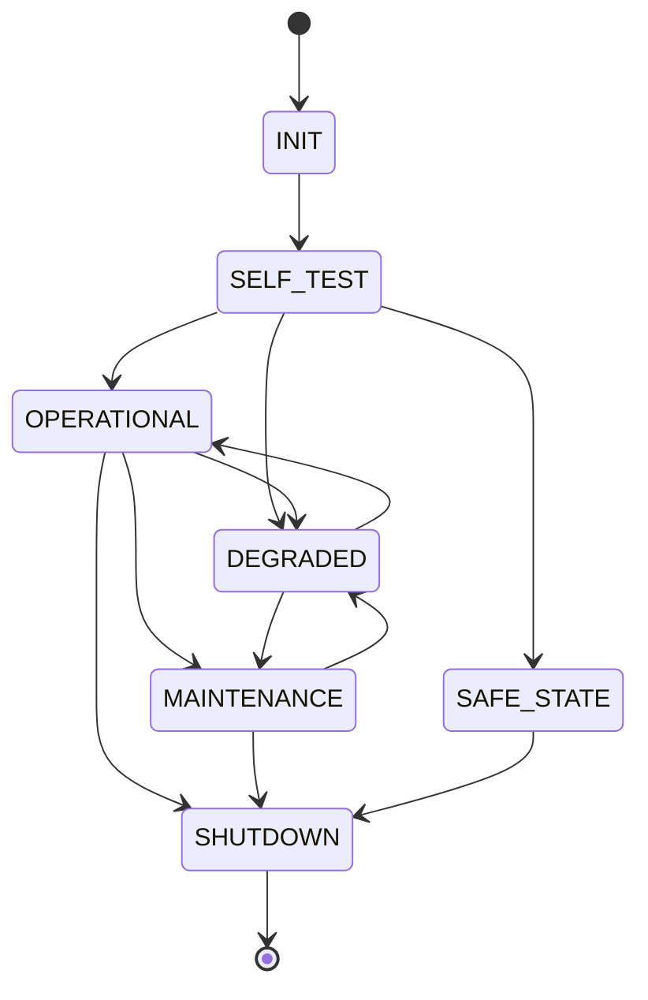

# Pseudocódigo: flujo general de funcionamiento del sistema.

```pseint
Algoritmo ECU
	// ============================================================
	// Códigos de estado (la máquina de estados vive en este bucle)
	// ============================================================
	Definir INIT, SELF_TEST, OPERATIONAL, DEGRADED Como Entero
	Definir SAFE_STATE, MAINTENANCE, SHUTDOWN Como Entero
	INIT        <- 0
	SELF_TEST   <- 1
	OPERATIONAL <- 2
	DEGRADED    <- 3
	SAFE_STATE  <- 4
	MAINTENANCE <- 5
	SHUTDOWN    <- 6

	// ============================================================
	// Señales de los sensores del vehículo
	// ============================================================
	Definir flujoAire, presionAceite, tempAceite, tempMotor Como Real
	Definir humedadMotor, rpm, velocidad, kilometraje, tempAmbiente Como Real

	// Banderas de la máquina de estados
	Definir estado Como Entero
	Definir rpmNormal Como Logico
	Definir sistemaActivo Como Logico
	Definir opcion Como Entero

	// Supuesto del equipo: banda de RPM consideradas "normales"
	// (homework.md menciona "RPM en condiciones normales" sin dar el rango)
	Definir RPM_MIN_NORMAL, RPM_MAX_NORMAL Como Real
	RPM_MIN_NORMAL <- 700
	RPM_MAX_NORMAL <- 6000

	// ============================================================
	// Estado inicial: el sistema debe iniciar en INIT
	// ============================================================
	estado <- INIT
	sistemaActivo <- Verdadero

	Mientras sistemaActivo Hacer

		//-----------------------------------------------------------
		// INIT -> SELF_TEST
		//-----------------------------------------------------------
		Si estado = INIT Entonces
			Escribir "[INIT] Inicializando ECU..."
			estado <- SELF_TEST

		//-----------------------------------------------------------
		// SHUTDOWN: apagado para evitar daños y fin de la ejecución
		//-----------------------------------------------------------
		Sino Si estado = SHUTDOWN Entonces
			Escribir "[SHUTDOWN] Apagando el vehiculo para evitar danos..."
			sistemaActivo <- Falso

		//-----------------------------------------------------------
		// SAFE_STATE: condición segura, la única salida es SHUTDOWN
		//-----------------------------------------------------------
		Sino Si estado = SAFE_STATE Entonces
			Escribir "[SAFE_STATE] Estado seguro. Operaciones limitadas."
			Escribir "Ingrese 1 para apagar el motor (unica salida): "
			Leer opcion
			Si opcion = 1 Entonces
				estado <- SHUTDOWN
			FinSi

		//-----------------------------------------------------------
		// Estados que leen y procesan sensores:
		// SELF_TEST, OPERATIONAL, DEGRADED, MAINTENANCE
		//-----------------------------------------------------------
		Sino
			// Aviso propio del estado MAINTENANCE (opera como normal)
			Si estado = MAINTENANCE Entonces
				Escribir "[MAINTENANCE] Mantenimiento requerido. El sistema sigue operando."
			FinSi

			// === 1) Lectura de las señales de los sensores ===
			Escribir "--- Ingrese lectura de sensores ---"
			Escribir "Flujo de aire (m3/s): "
			Leer flujoAire
			Escribir "Presion de aceite (PSI): "
			Leer presionAceite
			Escribir "Temp. de aceite (C): "
			Leer tempAceite
			Escribir "Temp. de motor (C): "
			Leer tempMotor
			Escribir "Humedad de motor (%): "
			Leer humedadMotor
			Escribir "RPM (rev/min): "
			Leer rpm
			Escribir "Velocidad (km/h): "
			Leer velocidad
			Escribir "Kilometraje (km): "
			Leer kilometraje
			Escribir "Temp. ambiente (C): "
			Leer tempAmbiente

			// === 2) Monitoreo de velocidad (advertencia, sin cambio de estado) ===
			Si velocidad > 170 Entonces
				Escribir "ADVERTENCIA: la velocidad supera los 170 km/h."
			FinSi

			// ¿Las RPM están en condiciones normales?
			rpmNormal <- (rpm >= RPM_MIN_NORMAL Y rpm <= RPM_MAX_NORMAL)

			// === 3) Reglas de decisión (evaluadas por severidad) ===
			Si estado = SELF_TEST Entonces
				// Transiciones permitidas: OPERATIONAL / DEGRADED / SAFE_STATE
				Si tempMotor > 120 O humedadMotor >= 90 O presionAceite > 50 O (rpmNormal Y flujoAire < 0.1) Entonces
					estado <- SAFE_STATE
				Sino Si tempAceite > 120 O tempAmbiente < -10 O tempAmbiente > 45 O flujoAire < 0 O flujoAire > 0.5 O humedadMotor > 40 Entonces
					estado <- DEGRADED
				Sino
					estado <- OPERATIONAL
				FinSi
			Sino
				// OPERATIONAL / DEGRADED / MAINTENANCE
				// Prioridad 1 - falla fatal: apagado inmediato
				Si tempMotor > 120 O humedadMotor >= 90 Entonces
					estado <- SHUTDOWN
				// Prioridad 2 - falla crítica: estado seguro
				Sino Si presionAceite > 50 O (rpmNormal Y flujoAire < 0.1) Entonces
					estado <- SAFE_STATE
				// Prioridad 3 - mantenimiento por kilometraje
				Sino Si kilometraje >= 14000 Entonces
					estado <- MAINTENANCE
				// Prioridad 4 - falla recuperable: operación limitada
				Sino Si tempAceite > 120 O tempAmbiente < -10 O tempAmbiente > 45 O flujoAire < 0 O flujoAire > 0.5 O humedadMotor > 40 Entonces
					estado <- DEGRADED
				// Sin fallas: operación normal
				Sino
					estado <- OPERATIONAL
				FinSi
			FinSi
		FinSi

		//-----------------------------------------------------------
		// Reporte del estado actual del sistema
		//-----------------------------------------------------------
		Si estado = INIT Entonces
			Escribir "Estado actual: INIT"
		Sino Si estado = SELF_TEST Entonces
			Escribir "Estado actual: SELF_TEST"
		Sino Si estado = OPERATIONAL Entonces
			Escribir "Estado actual: OPERATIONAL"
		Sino Si estado = DEGRADED Entonces
			Escribir "Estado actual: DEGRADED"
		Sino Si estado = SAFE_STATE Entonces
			Escribir "Estado actual: SAFE_STATE"
		Sino Si estado = MAINTENANCE Entonces
			Escribir "Estado actual: MAINTENANCE"
		Sino Si estado = SHUTDOWN Entonces
			Escribir "Estado actual: SHUTDOWN"
		FinSi

	FinMientras

	Escribir "Ejecucion finalizada."
FinAlgoritmo
```

# Máquina de estados: estados, transiciones y condiciones de cambio.

## Estados

- `INIT`: Estado inicial del ECU
- `SELF_TEST`: Estado en donde revisa funcionalidad basica de componentes
- `OPERATIONAL`: Estado considerada operacion normal
- `DEGRADED`: Operación limitada
- `SAFE_STATE`: Mantener en condiciones seguras
- `SHUTDOWN`: Estatus que realiza el apagado para evitar daños en el carro
- `MAINTENANCE`: Estado donde el ECU funciona como estatus normal. Simplemente muestra el mensaje que el mantenimiento es requerido

## Diagrama general de estados

- `INIT` -> `SELF_TEST`
- `SELF_TEST` -> `OPERATIONAL`
- `SELF_TEST` -> `DEGRADED`
- `SELF_TEST` -> `SAFE_STATE`
- `OPERATIONAL` -> `DEGRADED`
- `OPERATIONAL` -> `MAINTENANCE`
- `OPERATIONAL` -> `SHUTDOWN`
- `DEGRADED` -> `MAINTENANCE`
- `DEGRADED` -> `OPERATIONAL`
- `MAINTENANCE` -> `DEGRADED`
- `MAINTENANCE` -> `SHUTDOWN`



# Requerimientos funcionales: funciones que el sistema deberá cumplir.

## Sensores

- Flujo de Aire (m³/s)
- Presión de Aceite (PSI)
- Temperatura de Aceite (°C)
- Temperatura de Motor (°C)
- Humedad de Motor (%)
- RPM (revoluciones/minuto)
- Velocidad (km/h)
- Kilometraje (km)
- Temperatura Ambiente (°C)

## Funciones del sistema

El sistema debe:

- Iniciar en el estado `INIT`
- Monitorear que la velocidad no sobrepase los 170 km/h
- Cambiar al estado `DEGRADED` si la temperatura de aceite sobrepasa los 120 °C
- Monitorear que la temperatura ambiente esté en el rango operacional de -10 °C a 45 °C. Si está fuera de rango, cambiar a `DEGRADED`
- Monitorear el flujo de aire sea el adecuado (rango: 0 a 0.5 m³/s)
- Si las RPM están en condiciones normales pero el flujo de aire es insuficiente (< 0.1 m³/s), cambiar inmediatamente a `SAFE_STATE`
- Si la temperatura del motor sobrepasa los 120 °C, cambiar automáticamente a `SHUTDOWN`
- Si la presión de aceite sobrepasa los 50 PSI, cambiar a `SAFE_STATE`
- Después de 14,000 km recorridos, cambiar a `MAINTENANCE`
- Si la humedad del motor es superior al 40%, marcar estado `DEGRADED`
- Si la humedad del motor alcanza el 90% o superior, cambiar a `SHUTDOWN`

# Presentación del proyecto: explicación clara y coherente de la propuesta.